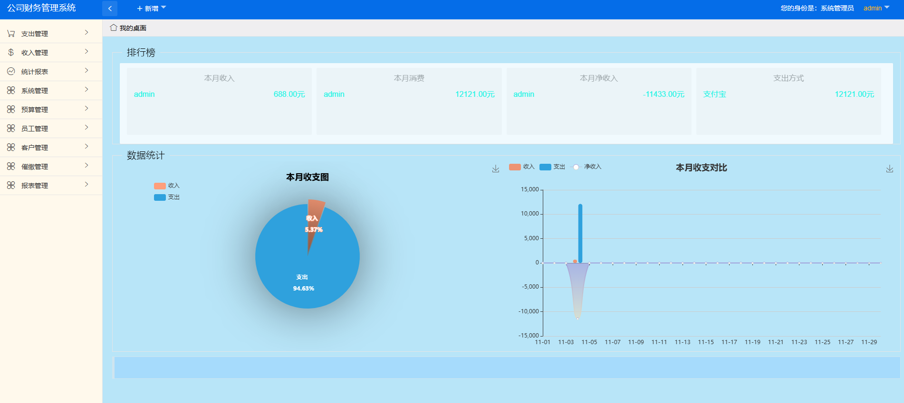

##                                 SpringBoot后台财物管理系统

> 基于Springboot + layui  (拉下代码可直接run)
#### 基本信息：

-
- **开发环境**： windows+jdk1.8+IDEA+mysql
我用的IDE是`jetbrains IntelliJ IDEA`，如果用Eclipse也许会有问题。
- **注意事项**：调试之前请创建名为financial的数据库，相关sql脚本为项目根目录下`financial.sql`, 账户密码都是admin

